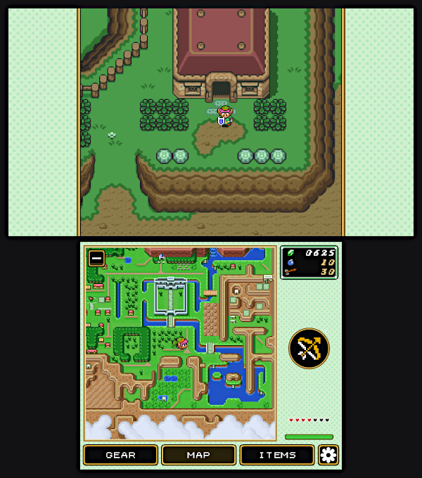

# The Legend of Zelda: A Link to the Past

A native reimplementation of *The Legend of Zelda: A Link to the Past*, built from the [snesrev/zelda3](https://github.com/snesrev/zelda3) project. It adds widescreen support, a higher-resolution world map, and a range of quality-of-life options.

## What you need to provide

You must own the game. Put a **US** *A Link to the Past* ROM in the port folder and the port does the rest.

1. Copy your ROM to `ports/zelda-lttp/` and name it `zelda3.sfc` *(a matching US ROM sitting in your `snes` roms folder is also detected).*
2. Launch the port. On the first run it verifies the ROM and rebuilds the game's assets (`zelda3_assets.dat`) on the device. This takes a minute or two and only happens once.

The supported ROM is US v1.0, SHA-256 `66871d66be19ad2c34c927d6b14cd8eb6fc3181965b6e517cb361f7316009cfb`. Other regions and revisions are not supported.

Already have a `zelda3_assets.dat` from a PC build? Drop it straight into `ports/zelda-lttp/` and the first-run step is skipped.

## Dual Screen

This port will use the bottom screen of a dual-screen handheld such as the AYN Thor for a companion instance, with working touch controls:

## Configuration

The port re-tunes the display and performance settings in `zelda3.ini` to your device on every launch, so it's fully portable — copy it to any handheld and it adapts (screen aspect/resolution, Mode-7 map, audio buffer, renderer). Your edits to gameplay features, controls, and MSU are left alone. Settings live in `ports/zelda-lttp/zelda3.ini`, with a few of the most used settings toggleable with a bottom screen at runtime. Highlights:

- **Widescreen**: set `ExtendedAspectRatio` to `16:9`, `16:10`, or `18:9` (default `4:3`).
- **World map quality**: `EnhancedMode7` (lower it to `0` on weak devices if the map scroll stutters).
- **Output method**: capable devices default to `OpenGL ES` (cleaner widescreen); rk3326-class devices fall back to `SDL`. Override `OutputMethod` if a device misbehaves.
- **Audio**: raise `AudioSamples` to `2048` if you hear crackling.
- **MSU-1 custom soundtrack**: set `EnableMSU` and drop the tracks under `ports/zelda-lttp/msu/`.

Controller input is native; the SNES-to-pad layout is under `[GamepadMap]`.

## Sprite Mods

Alternative sprites are available at https://github.com/snesrev/sprites-gfx. Download the repository and copy the **contents** of `sprites-gfx-testing.zip\sprites-gfx-testing\snes\zelda3\` to your `zelda-lttp/alt` folder. Then, edit `zelda3.ini` to uncomment the `LinkGraphics =` line and edit the path to point to the sprite you want to use.

## Achievements

When using a second screen, the bottom screen's settings menu will display an achievements list. This is an offline copy of the RetroAchievements core set, which is useful for tracking file progress.

## Credits
- Original port (hosted on PortMaster) by tekkenfede. Automated handling of first run and config by Jeod.
- Game reimplementation: the [snesrev/zelda3](https://github.com/snesrev/zelda3) project.
- Dual-screen add-on by [samyost1](https://github.com/samyost1/zelda3-android) and ported to linux arm by Jeod.
- *The Legend of Zelda: A Link to the Past* is © Nintendo. This port ships no game assets; they are rebuilt from your own ROM.
